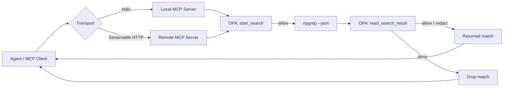

# ripgrep-mcp

Minimal MCP server skeleton that:

- starts bounded `ripgrep` searches as background jobs
- polls job status through MCP tools
- cancels running searches
- applies an OPA decision before returning results

## Deployment

This repo supports both **stdio** and **Streamable HTTP**. Use stdio for local launches. Use Streamable HTTP when the MCP server needs to run on the host that has the files and `rg`.

- an MCP client or host on the agent side
- a remote MCP server on the machine that has the files and `rg`
- OPA running alongside the server to redact sensitive output before it leaves that host



## Flow

1. The agent asks for a search.
2. The MCP client sends the request over `stdio` or Streamable HTTP.
3. The server checks the search request against OPA before launching `rg`.
4. The server runs `rg --json` on the host that contains the repository.
5. The server normalizes each match and checks it against OPA again.
6. OPA allows, denies, or redacts each result before the server returns output.

## Environment

- `OPA_URL` - base URL for OPA, for example `http://localhost:8181`
- `OPA_POLICY_PATH` - policy path under `v1/data`, default: `search/decision`
- `RG_BIN` - override the `rg` binary path, default: `rg`

## Tools

- `search_start`
- `search_status`
- `search_cancel`

## Notes

The server uses `rg --json` so it can parse matches safely and keep long-running searches asynchronous.
The sample OPA policy lives in [opa/search.rego](/home/user/ripgrep-mcp/opa/search.rego) and returns:

- `allow`
- `redactSnippet`
- `redactPath`

The sample policy includes heuristics for common secret, PII, and PHI patterns. It is intentionally conservative and should be treated as a redaction layer, not a compliance guarantee.

Redaction reasons are explicit classifications emitted by the policy-backed matcher. If a result is redacted, the `redactionReasons` array contains the named rule matches that fired. The server does not add a generic fallback reason.

Search defaults:

- literal string matching is enabled by default
- case-insensitive matching is enabled by default
- set `literal: false` to use regex search
- set `caseInsensitive: false` to use case-sensitive search

## Run

```bash
npm install
npm run build
npm start
```

## Sample MCP Config

The repo includes a sample client config at [mcp-config.sample.json](/home/user/ripgrep-mcp/mcp-config.sample.json).
Use `ripgrep-mcp-stdio-no-opa` for a local stdio launch without policy enforcement.
Use `ripgrep-mcp-stdio-with-opa` if you want the server to call OPA before returning search results.
Use `ripgrep-mcp-http` if you are connecting to the Streamable HTTP endpoint.

If you do not want OPA, leave `OPA_URL` unset. The server will allow searches directly in that case.

To run the remote HTTP transport locally:

```bash
MCP_TRANSPORT=streamable-http MCP_HTTP_PORT=3000 npm start
```

To use the sample policy, set `OPA_URL` to your OPA instance and load the `search` package from [opa/search.rego](/home/user/ripgrep-mcp/opa/search.rego).

## Docker Compose

```bash
docker compose up --build
```

The compose setup starts:

- `opa` on `localhost:8181`
- `ripgrep-mcp` in Streamable HTTP mode on `localhost:3000`

The MCP server listens on `http://localhost:3000/mcp` in the compose setup.

## Testing

Use Docker Compose to run both the MCP server and OPA locally:

```bash
docker compose up --build
```

With the stack running:

- OPA is available on `http://localhost:8181`
- the MCP server is available on `http://localhost:3000/mcp`
- the server reads policy decisions from `OPA_URL=http://opa:8181`

That makes it easy to test the policy path without any LLM. A typical flow is:

1. Start the stack with Docker Compose.
2. Connect any MCP client to `http://localhost:3000/mcp`.
3. Call `search_start` with a repository path and pattern.
4. Poll `search_status` with the returned `job_id`.
5. Use `search_cancel` if you want to verify cancellation behavior.

If you want to exercise the server manually from the command line, use an MCP client or inspector against the Streamable HTTP endpoint rather than an LLM-backed host.

### MCP Inspector

MCP Inspector is the easiest way to test the server without any LLM. With the Docker Compose stack running, you can inspect the server in either UI or CLI mode:

```bash
# Open the Inspector UI
npx @modelcontextprotocol/inspector

# Or run a CLI smoke test against the compose server
npx @modelcontextprotocol/inspector --cli http://localhost:3000/mcp --transport http --method tools/list
```

In the UI, connect to `http://localhost:3000/mcp` as a Streamable HTTP server, then call `search_start`, `search_status`, and `search_cancel` directly.

Tip: when the server runs in Docker Compose, use `/workspace` as the `root` for `search_start`. The container does not see your host filesystem path, and the sample OPA policy denies dot-prefixed roots such as `.`.

## Next Steps

1. Add authentication at the HTTP layer, such as a bearer token or mTLS.
2. Make search results paginated so large queries do not dump too much data into one response.
3. Add unit tests for the rg JSON parser and OPA decision shaping.
4. Replace heuristic PII and PHI detection with a stricter policy rule set tuned to your environment.
