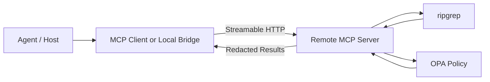

# ripgrep-mcp

Minimal MCP server skeleton that:

- starts bounded `ripgrep` searches as background jobs
- polls job status through MCP tools
- cancels running searches
- applies an OPA decision before returning results

## Deployment

This repo supports both **stdio** and **Streamable HTTP**. Use stdio for local launches. Use Streamable HTTP when the MCP server needs to run on the host that has the files and `rg`.

- an MCP client or host on the agent side
- a remote MCP server on the machine that has the files and `rg`
- OPA running alongside the server to redact sensitive output before it leaves that host



## Flow

1. The agent asks for a search.
2. The MCP client sends the request to the remote MCP server.
3. The server runs `rg` on the host that contains the repository.
4. The server normalizes matches and sends them through OPA.
5. OPA allows, denies, or redacts the result.
6. The server returns only the approved output.

## Environment

- `OPA_URL` - base URL for OPA, for example `http://localhost:8181`
- `OPA_POLICY_PATH` - policy path under `v1/data`, default: `search/decision`
- `RG_BIN` - override the `rg` binary path, default: `rg`

## Tools

- `search_start`
- `search_status`
- `search_cancel`

## Notes

The server uses `rg --json` so it can parse matches safely and keep long-running searches asynchronous.
The sample OPA policy lives in [opa/search.rego](/home/user/ripgrep-mcp/opa/search.rego) and returns:

- `allow`
- `redactSnippet`
- `redactPath`

The sample policy includes heuristics for common secret, PII, and PHI patterns. It is intentionally conservative and should be treated as a redaction layer, not a compliance guarantee.

## Run

```bash
npm install
npm run build
npm start
```

To run the remote HTTP transport locally:

```bash
MCP_TRANSPORT=streamable-http MCP_HTTP_PORT=3000 npm start
```

To use the sample policy, point `OPA_URL` at your OPA instance and load the `search` package from [opa/search.rego](/home/user/ripgrep-mcp/opa/search.rego).

## Docker Compose

```bash
docker compose up --build
```

The compose setup starts:

- `opa` on `localhost:8181`
- `ripgrep-mcp` in Streamable HTTP mode on `localhost:3000`

The MCP server listens on `http://localhost:3000/mcp` in the compose setup.

## Next Steps

1. Add authentication at the HTTP layer, such as a bearer token or mTLS.
2. Make search results paginated so large queries do not dump too much data into one response.
3. Add unit tests for the rg JSON parser and OPA decision shaping.
4. Replace heuristic PII and PHI detection with a stricter policy rule set tuned to your environment.
